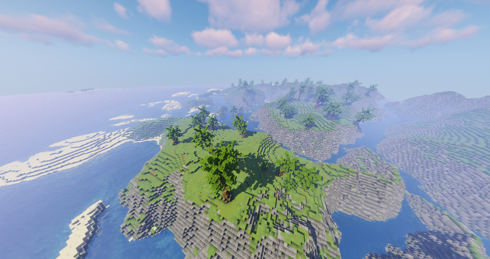

# tropical archipelago

## custom material layers
1. flats (complex - blobs: 100):
	- grass (count: 100)
	- dirt (count: 3)
	- moss (count: 50)
2. slope (complex - blobs: 50):
	- cobble (count: 3)
	- tuff (count: 2)
3. wetstone (complex - blobs: 50):
	- cobble (count: 2)
	- tuff (count: 2)
	- mossy cobble (count: 3)
4. sand (simple):
	- sand

## painting the hightmap
1. create general blob/shape (of a decent height)
2. add dunes_02
3. subtract ro_crack2

## painting the materials
1. flats:
	- except on water
2. sand:
	- below 20 degrees
	- at or below (sea level + 3)
3. slope:
	- above 35 degrees
4. wetstone
	- above 35 degrees
	- at or below (sea level + 3)
5. sand:
	- at or below (sea level + 0)
	- only on flats
6. sand:
	- finish up all sandbanks by hand
	- only on flats
	
## adding details
1. trees:
	- below 20 degrees
	- except on water
2. grass:
	- only on flats